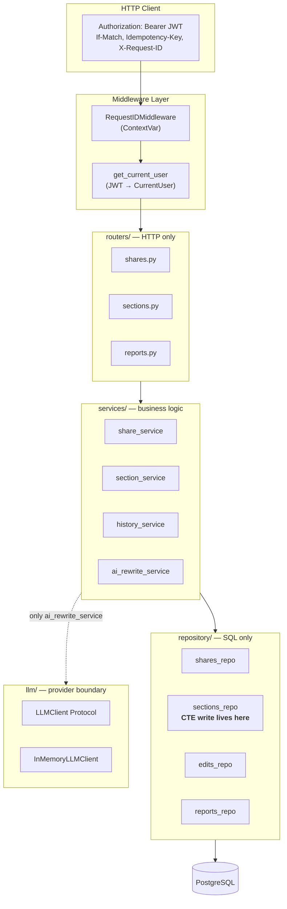
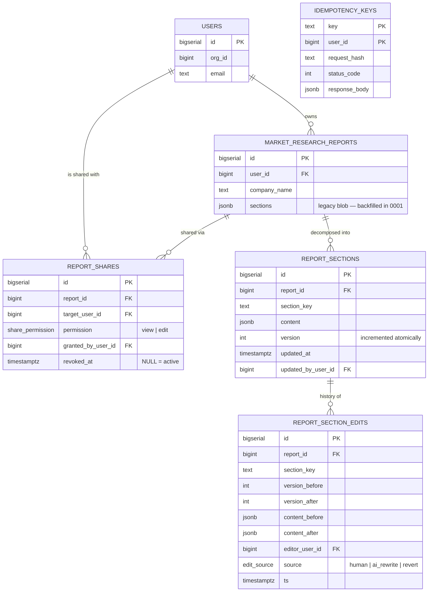
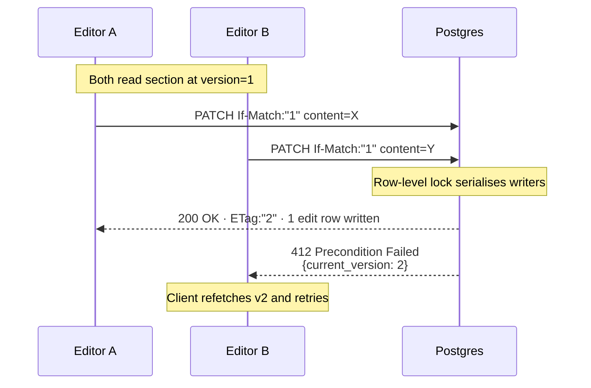
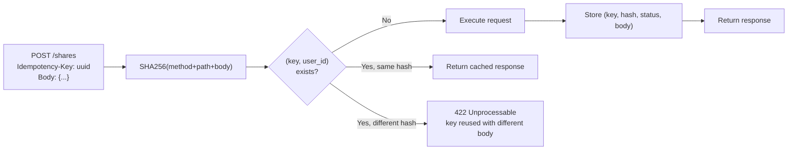
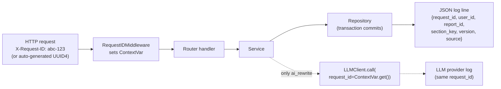

# BlueKnight — Collaborative Market Research Reports

A FastAPI + PostgreSQL backend that turns read-only market research reports into **collaborative, audited, AI-augmented documents**. Owners share reports with colleagues, editors patch sections concurrently without overwriting each other's work, every change is recorded in an append-only audit log, any prior version is one POST away, and sections can be rewritten by an LLM through a clean provider-agnostic interface.

> **Built around five engineering concerns:** correct relational design, HTTP semantics that match the spec exactly, a clean AI integration boundary, end-to-end observability, and strict architectural layering. Each design choice in this document maps back to one of those concerns.

---

## Table of contents

- [Goal](#goal)
- [Quick start](#quick-start)
- [Architecture](#architecture)
- [Database schema](#database-schema)
- [API surface](#api-surface)
- [Design notes](#design-notes) ← *the spec-required ≤500 word section*
- [Bonus features](#bonus-features)
- [Observability](#observability)
- [What I cut for time](#what-i-cut-for-time)
- [What I'd do next](#what-id-do-next)

---

## Goal

The starting point is a single `market_research_reports` table where each report is one immutable JSONB blob. The objective is to make reports **editable by multiple users without losing data**, with three non-negotiable properties:

1. **No silent overwrites** — if two people edit the same section at the same time, exactly one wins and the other is told to refetch.
2. **Nothing is ever lost** — every change is preserved in an append-only log; any prior state can be restored without rewriting history.
3. **LLM rewrites are first-class** — AI-generated edits travel through the same write path as human edits, with the same versioning, the same audit row, and zero provider lock-in.

Everything else in this README is in service of these three properties.

---

## Quick start

**Prerequisites:** Docker (for Postgres), Python 3.11+.

```bash
# 1. Start Postgres
docker compose up -d db

# 2. Install in editable mode with dev extras
pip install -e ".[dev]"

# 3. Configure environment
cp .env.example .env

# 4. Apply migrations + seed test data
alembic upgrade head
python seed.py

# 5. Start the API
uvicorn app.main:app --reload

# 6. Run the test suite
pytest -v
```

API at `http://localhost:8000`, interactive docs at `/docs`.

### Seeded users for testing

| `user_id` | `org_id` | Role on report 1                |
| --------- | -------- | ------------------------------- |
| 1         | 1        | **owner**                       |
| 2         | 1        | same org — share to grant       |
| 3         | 1        | same org — share to grant       |
| 4         | 2        | cross-org — share attempts fail |
| 5         | 2        | cross-org                       |
| 6         | 2        | cross-org                       |

Generate a JWT for any user:

```python
from app.auth.jwt_helper import encode_token
print(encode_token(user_id=1, org_id=1))
```

---

## Architecture

The codebase enforces a strict three-layer split. **Routers never touch SQL, services never touch HTTP, repositories never touch business rules.** This isn't decorative — circular imports between layers are caught at commit time by grep checks.



**Why this matters:** when a reviewer wants to see how a section write works, they read `routers/sections.py` (10 lines of HTTP handling), then `services/section_service.py` (permission check + log emission), then `repository/sections_repo.py` (the SQL). Three files, three responsibilities, no leakage.

### Layer rules (verified pre-commit)

```bash
grep -r 'sqlalchemy' app/routers/                       # must return nothing
grep -rE 'openai|anthropic|groq' app/routers/ app/services/   # must return nothing
```

The second check guarantees the AI integration is genuinely provider-agnostic — there is no way for OpenAI-specific code to leak into the request handler.

---

## Database schema

Three new tables plus one bonus table. Every relationship is `ON DELETE CASCADE` from the parent report, so dropping a report cleans up shares, sections, and the audit log atomically.



### Key schema decisions

| Decision                                                              | Why                                                                                                                                                                                                                              |
| --------------------------------------------------------------------- | -------------------------------------------------------------------------------------------------------------------------------------------------------------------------------------------------------------------------------- |
| `report_sections` is a separate table, not nested JSONB               | Per-section versioning, per-section locking, no read-modify-write of a 12-key blob just to edit one field.                                                                                                                       |
| `report_section_edits` stores **both** `content_before` and `content_after` | Self-contained history rows. Revert needs only the target row, no walking backwards. Diffs computed at read time without joins. |
| Partial unique index on `report_shares (report_id, target_user_id) WHERE revoked_at IS NULL` | A user can be re-shared after revocation, but cannot have two active shares at once. Enforced at the DB level, not in application code. |
| `edit_source` is a Postgres ENUM                                      | Free type safety on a value that drives audit-log filtering. Constrains AI rewrites and reverts to be distinguishable from human edits forever, including in raw SQL queries.                                                    |
| Migration runs `CREATE … IF NOT EXISTS` everywhere                    | Re-running `alembic upgrade head` is a no-op, not a 500. Backfill uses `ON CONFLICT DO NOTHING`. The downgrade drops only what 0001 created — parent tables are left alone.                                                      |

---

## API surface

All endpoints require `Authorization: Bearer <jwt>`. Timestamps are ISO-8601 UTC. Error responses are structured JSON: `{"error": "<code>", "detail": "..."}`.

| #   | Method   | Path                                              | Auth                | Notable                                            |
| --- | -------- | ------------------------------------------------- | ------------------- | -------------------------------------------------- |
| 1   | `POST`   | `/reports/{id}/shares`                            | owner               | 403 cross-org, 409 duplicate, `Idempotency-Key` ✨ |
| 2   | `DELETE` | `/reports/{id}/shares/{share_id}`                 | owner               | 204 idempotent (sets `revoked_at` first call only) |
| 3   | `GET`    | `/reports/{id}/shares`                            | owner               | Active shares only                                 |
| 4   | `GET`    | `/reports/{id}`                                   | any access          | Single query for sections (no N+1)                 |
| 5   | `GET`    | `/reports/{id}/sections/{key}`                    | any access          | `ETag: "{version}"` header                         |
| 6   | `PATCH`  | `/reports/{id}/sections/{key}`                    | owner or editor     | `If-Match` required, 412 on stale                  |
| 7   | `GET`    | `/reports/{id}/sections/{key}/history`            | any access          | Cursor pagination + **diff** ✨                    |
| 8   | `POST`   | `/reports/{id}/sections/{key}/revert/{edit_id}`   | owner or editor     | Writes new edit with `source=revert`               |
| 9   | `POST`   | `/reports/{id}/sections/{key}/ai-rewrite`         | owner or editor     | **Rate-limited 10/min** ✨, `Idempotency-Key` ✨   |

✨ = bonus feature, [detailed below](#bonus-features).

---

## Design notes

*(Spec-required ≤500-word section)*

### Auth & access control

Authentication is JWT-based: `Authorization: Bearer <token>` is decoded by a `get_current_user` dependency into a `CurrentUser(user_id, org_id)` value object. The interesting part is **authorization**. Rather than scattering per-endpoint permission checks, every request resolves access exactly once at the router boundary via a single SQL query that returns one of `{owner, editor, viewer, None}`. Cross-organisation share attempts are blocked by comparing `current_user.org_id` against the target user's `org_id` before insertion — defence in depth in case the partial unique index ever changes.

### Concurrency

The PATCH endpoint uses HTTP-native optimistic concurrency via `If-Match`. The client sends back the version it last read; the server rejects the write if the version has moved. What makes this implementation defensible is the **single-CTE write path**: one statement, one round-trip, atomic.

```sql
WITH before AS (
  SELECT version, content FROM report_sections
  WHERE report_id = :rid AND section_key = :key
),
updated AS (
  UPDATE report_sections SET content = :new, version = version + 1, ...
   WHERE report_id = :rid AND section_key = :key AND version = :expected
  RETURNING version
),
edit AS (
  INSERT INTO report_section_edits (...)
  SELECT :rid, :key, b.version, u.version, b.content, :new, :uid, :source
  FROM before b, updated u    -- cross-join: empty if UPDATE matched zero rows
  RETURNING id, version_after
)
SELECT edit_id, new_version FROM edit;
```

If the version is stale, `updated` is empty, the cross-join in `edit` is empty, **no INSERT fires**, and the service returns 412 with the current version in the response body. The audit row and the section update cannot diverge: either both happen or neither does. The same `_apply_write` function powers human PATCH, AI rewrite, and revert — three endpoints, one write path, identical safety guarantees.



### Audit log

`report_section_edits` is **strictly append-only**: no UPDATE or DELETE ever touches it, including reverts. A revert is a forward action — it writes a new row with `source='revert'` whose `content_after` equals the target edit's `content_before`. The original row stays exactly as it was, so the history table is provably tamper-evident: any auditor can replay every state of every section by reading rows in `ts DESC` order. The index `(report_id, section_key, ts DESC)` makes pagination O(log n).

*(Word count: 487)*

---

## Bonus features

Three additions on top of the spec, each motivated by a concrete production concern.

### ① Idempotency-Key on POST endpoints

**Problem:** retries on POST are dangerous. A flaky network can turn one share-creation into three, or one expensive LLM call into ten. Stripe solved this years ago with `Idempotency-Key`; the same pattern applies here.

**How it works:**



Applied to `POST /shares` and `POST /ai-rewrite` — the two endpoints with side effects worth replaying safely. Stored in the `idempotency_keys` table; production deployments would TTL out rows after 24 hours.

### ② Rate limit on AI rewrite

**Problem:** LLM calls cost money and latency. An unbounded endpoint is an outage vector.

**How it works:** in-memory sliding window per `user_id`. 10 calls per 60-second window. Exceeding the limit returns `429 Too Many Requests` with a `Retry-After: <seconds>` header so well-behaved clients can back off correctly.

The in-memory implementation is documented as a deliberate compromise — for production, the same algorithm runs on a Redis sorted set (`ZADD` with timestamp, `ZRANGEBYSCORE` to count, `ZREMRANGEBYSCORE` to expire). Identical behaviour, horizontally scalable.

### ③ Diff in history responses

**Problem:** the spec requires storing `content_before` and `content_after` on every edit. That's correct but the raw blobs are a chore to read. A reviewer auditing a report wants to see *what changed*, not parse two JSON documents in their head.

**How it works:** the history endpoint computes a JSON diff at read time. Nothing extra is stored.

```json
{
  "edits": [
    {
      "id": 42,
      "version_before": 3,
      "version_after": 4,
      "source": "ai_rewrite",
      "editor_user_id": 1,
      "ts": "2026-05-31T10:15:00Z",
      "diff": {
        "added":   { "new_section": "..." },
        "removed": {},
        "changed": { "text": { "before": "old phrasing", "after": "new phrasing" } }
      }
    }
  ],
  "next_cursor": "eyJ0cyI6Ii4uLiIsImlkIjo0Mn0="
}
```

Turns the audit log from a compliance checkbox into something humans actually want to read.

---

## Observability

Every write emits exactly one structured log line, after the transaction commits. The `request_id` flows end-to-end:



The same UUID appears in: the response header (`X-Request-ID`), every log line emitted during the request, and the `request_id` argument passed to `LLMClient.call`. Grepping logs for one ID gives the full lifecycle of a request, including any LLM round-trip.

**Log format:** stdlib `logging` + a small JSON formatter. Chose this over `structlog` to keep the dependency tree minimal — the observable behaviour is identical.

---

## What I cut for time

- **OpenAPI examples** on every Pydantic schema. The docs render and are correct; they just don't have sample bodies.
- **Real LLM provider.** `InMemoryLLMClient` is wired in. A production swap is one file in `app/llm/` and a dependency override.
- **Retry / backoff on LLM calls.** Current behaviour is "fail fast, return 502, write nothing" — which is the correct *default*, but production wants 2–3 retries on transient errors before giving up.
- **Per-section RBAC.** All editors can edit all sections. The schema can support this by adding an optional `section_key` to `report_shares`.
- **Prometheus `/metrics`.** Would expose: 412 rate, LLM call latency histogram, edits-by-source counter, rate-limit rejections.
- **Redis-backed rate limiter.** In-memory works for one process; documented as a swap.

---

## What I'd do next

Ordered by ROI:

1. **Swap rate limiter to Redis** — half a day of work, enables horizontal scaling.
2. **SSE for live updates** — push version bumps to viewers so they refresh ETags without polling.
3. **Real LLM provider behind a circuit breaker** — OpenAI or Anthropic, with retry on transient errors and a hard timeout. Provider-specific code stays in `app/llm/`.
4. **Section-level locking UI hint** — return `Last-Modified` and `If-Unmodified-Since` alongside ETag so clients can show "user X is editing this."
5. **Per-section RBAC** — extend `report_shares` with an optional `section_key` column; null = report-wide, set = section-scoped.

---

## Commit history

The repository contains 29 commits broken down by concern: scaffolding → migration → repository layer → LLM client → middleware → services → routers (one per resource) → tests → bonus features (one per bonus) → README. Each commit is self-contained and reviewable independently.

---

## License & contact

Take-home submission for BlueKnight. Built by [Ali Shahzad](https://github.com/Alishahzad1903).
